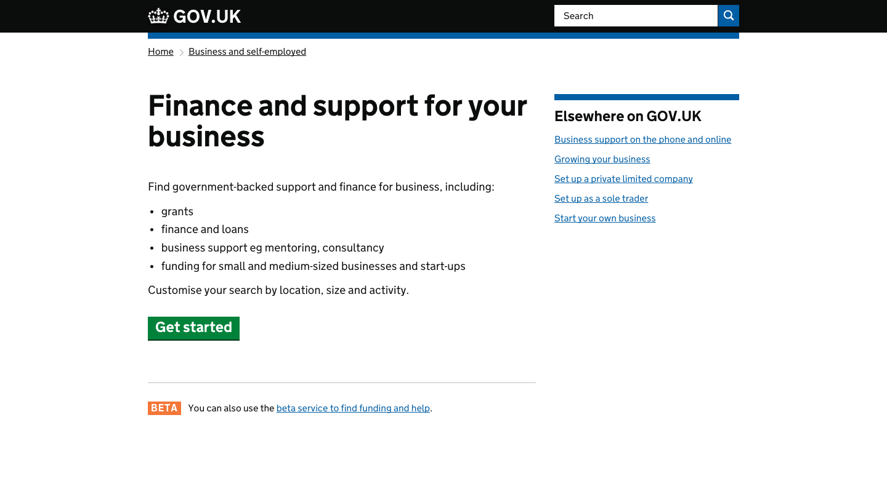
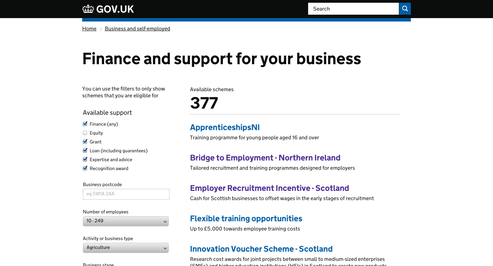

# Business Support Finder

Faceted search application for finding business support and finance options.

## Screenshots






## Live examples

- [gov.uk/business-finance-support-finder](https://www.gov.uk/business-finance-support-finder)
- [gov.uk/business-finance-support-finder/search](https://www.gov.uk/business-finance-support-finder/search)


## Technical documentation

This is a Ruby on Rails application that is a frontend to [business-support-api](https://github.com/alphagov/business-support-api)

It's a precursor to [finder-frontend](https://github.com/alphagov/finder-frontend) application, and should be merged in to it at some point. Currently it uses some filtering behaviour that `finder-frontend` does not support;

- location/postcode filtering
- a mix of `AND` / `OR` facet filters

The schemes themselves (eg [gov.uk/bridge-to-employment-northern-ireland](https://www.gov.uk/bridge-to-employment-northern-ireland)) are served by [frontend](https://github.com/alphagov/frontend) and managed in [publisher](https://github.com/alphagov/publisher).

### Dependencies

- [business-support-api](https://github.com/alphagov/business-support-api): Provides scheme filtering/results.
- [content-store](https://github.com/alphagov/content-store): Provides content and metadata.
- [publishing-api](https://github.com/alphagov/publishing-api): this app sends data to the content-store.
- [static](https://github.com/alphagov/static): Provides shared GOV.UK assets and templates.
- [rummager](https://github.com/alphagov/rummager): this app indexes its pages for search via Rummager.

### Running the application

On GOV.UK development machines:

```
$ bowl businesssupportfinder
```

Otherwise:

```
$ ./startup.sh
```

The app will run at [localhost:3024](http://localhost:3024) - or [businesssupportfinder.dev.gov.uk](http://businesssupportfinder.dev.gov.uk) on GOV.UK development machines.

### Running the test suite

```
$ bundle exec rake
```

### Publishing to GOV.UK

- `bundle exec rake publishing_api:publish` will send the business support finder pages to the publishing-api.

### Search indexing

- `bundle exec rake rummager:index` will send the data to Rummager for indexing in search.

## Licence

[MIT License](LICENCE)
